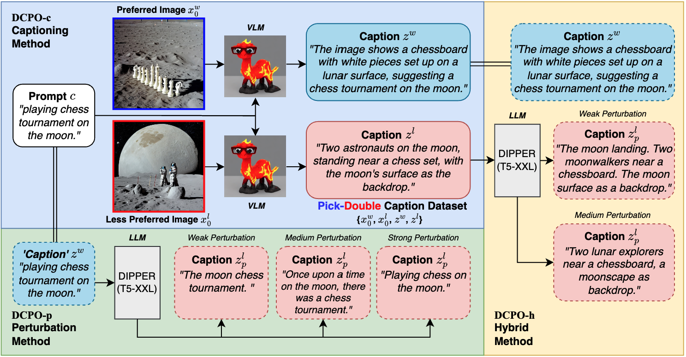
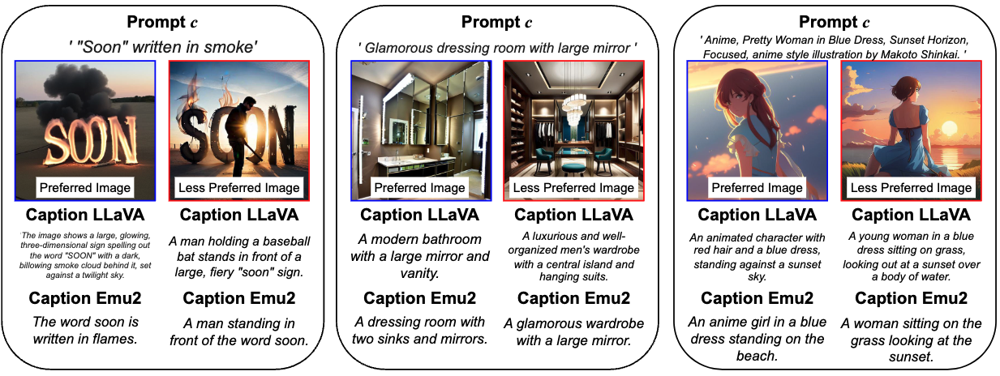

# Dual Caption Preference Optimization for Diffusion Models 

This repository provides the official PyTorch implementation for DCPO. 

<div align="center">

</div><br>

_By: Amir Saeidi<sup>\*</sup>, Yiran Luo<sup>\*</sup>, Agneet Chatterjee, Shamanthak Hegde, Bimsara Pathiraja, Yezhou Yang, Chitta Baral_
<br>_(<small><sup>*</sup> indicates equal contribution</small>)_


**Contents**:

* [Running DCPO training](#running-dcpo-training)
* [Pick-Double Caption Dataset](#dataset) 
* [Citation](#citation)

## Running DCPO training

### Hardware requirements

We ran our experiments on a node of 8 A100s (80GB). But `dcpo_trainer.py` can run on a single GPU having at least 40GB VRAM. 

### Environment

Create a Python virtual environment with your favorite package manager. 

After activating the environment, install PyTorch. We recommend following the [official website](https://pytorch.org/) for this. 

We refer to [diffusers](https://github.com/huggingface/diffusers/tree/main/examples/text_to_image) library to install other packages.

### Steps to run the code
<!-- [`yuvalkirstain/pickapic_v2`](https://huggingface.co/datasets/yuvalkirstain/pickapic_v2) -->
We performed our experiments on the Pick-Double Caption dataset and a subset of  Pic-a-Pic V2 adataset which is has 20,000 samples.

Below is an example training command for a single-GPU run:

```bash
accelerate launch dcpo_trainer.py \
  --pretrained_model_name_or_path=$MODEL_NAME \
  --dataset_name=$DATASET_NAME \
  --caption_1="caption_1" \
  --caption_0="caption_0" \
  --train_batch_size=1 \
  --dataloader_num_workers=16 \
  --gradient_accumulation_steps=128 \
  --max_train_steps=2000 \
  --lr_scheduler="constant_with_warmup" \
  --lr_warmup_steps=500 \
  --learning_rate=1e-08 \
  --scale_lr \
  --checkpointing_steps 500 \
  --output_dir=$OUTDIR \
  --mixed_precision="fp16" \
  --beta_dpo 500 \
```

> Note: `caption_0` and `caption_1` refer to the caption of image 0 and image 1 in the Pick-Double Caption dataset, similar to the Pick-a-Pic dataset.
## Pick-Double Caption Dataset

To create the Pick-Double Caption Dataset, we first generated captions for preferred and less preferred images in [`yuvalkirstain/pickapic_v2`](https://huggingface.co/datasets/yuvalkirstain/pickapic_v2) dataset using the [LLava-v1.6-34b](https://huggingface.co/liuhaotian/llava-v1.6-34b) and [Emu2](https://huggingface.co/BAAI/Emu2) models. Then, we used the [DIPPER](https://huggingface.co/kalpeshk2011/dipper-paraphraser-xxl) model to perturb the generated captions of less preferred images. We refer readers to Appendix D in DCPO paper for more information about perturbation.

<div align="center">

</div><br>
<p align="center">Examples of Pick-Double Caption dataset</p>

Below is an example perurbation command:

```bash
python perturb_caption.py \
  --hf_file=$DATASET_NAME \
  --out_folder=$OUTDIR \ 
```

Our work can be found via our Hugging Face Hub organization: https://huggingface.co/DualCPO.


## Acknowledgements
We thank the Research Computing (RC) at Arizona State University (ASU) and [cr8dl.ai](https://www.cr8dl.ai/) for their generous support in providing computing resources. The views and opinions of the authors expressed herein do not necessarily state or reflect those of the funding agencies and employers.


## Citation

```bibtex
@misc{saeidi2025dualcaptionpreferenceoptimization,
      title={Dual Caption Preference Optimization for Diffusion Models}, 
      author={Amir Saeidi and Yiran Luo and Agneet Chatterjee and Shamanthak Hegde and Bimsara Pathiraja and Yezhou Yang and Chitta Baral},
      year={2025},
      eprint={2502.06023},
      archivePrefix={arXiv},
      primaryClass={cs.CV},
      url={https://arxiv.org/abs/2502.06023}, 
}
```
